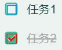
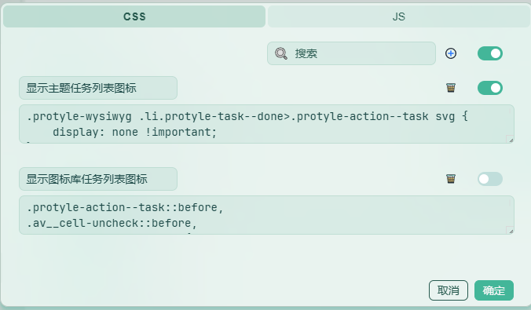
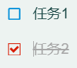
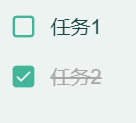
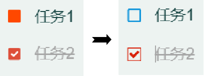

[中文](https://github.com/Glaube-TY/color-icon/blob/main/README_zh_CN.md) | English

Icon Data Source: [阿里巴巴矢量图标库](https://www.iconfont.cn/)

### 注意

Using this icon library under certain themes will conflict.

For example, if the QYL theme customizes the task list icon, it will cause the icon set by the theme to conflict with the icon of this icon library, and two overlapping check box icons will be displayed at the same time.



Solution:

Set the CSS code in "Settings" → "Appearance" → "Code Snippet" → "Settings". Add the following two sets of codes to CSS. By controlling the activation of different CSS codes, the desired task list icon has been displayed:





```css
/* Show icon library task list icon */
.protyle-action--task::before,
.av__cell-uncheck::before,
.av__cell-check::before {
    display: none !important;
}
```



> I'm using a mint color scheme with the QYL theme.

```css
/* Display the icon of the theme task list */
.protyle-wysiwyg .li.protyle-task--done>.protyle-action--task svg {
    display: none !important;
}

div.protyle-action.protyle-action--task svg {
    display: none !important;
}

.av__cell-uncheck > svg,
.av__cell-check > svg {
    display: none !important;
}

```

### Change Log
- 2025-05-29 v0.0.2 Replace task list check box icon

    - 

- 2025-05-21 v0.0.1 Icon library release