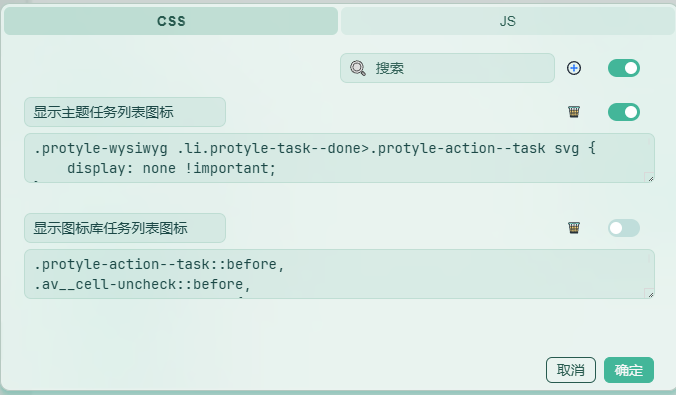
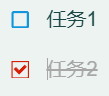
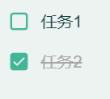

中文 | [English](https://github.com/Glaube-TY/color-icon/blob/main/README.md)

图标数据来源：[阿里巴巴矢量图标库](https://www.iconfont.cn/)

### 注意

在某些主题下使用这个图标库会发生冲突。

比如QYL主题自定义了任务列表图标，会导致主题设置的图标与这个图标库的图标冲突，会同时显示两个重叠的复选框图标。


解决方法：

在“设置”→“外观”→“代码片段”→“设置”中设置 CSS 代码，在 CSS 中分别添加以下两组代码，通过控制开启不同的 CSS 代码已显示想要的任务列表图标：





```css
/* 显示图标库任务列表图标 */
.protyle-action--task::before,
.av__cell-uncheck::before,
.av__cell-check::before {
    display: none !important;
}
```



> 我这里使用的是 QYL 主题的薄荷配色。

```css
/* 显示主题任务列表图标 */
.protyle-wysiwyg .li.protyle-task--done>.protyle-action--task svg {
    display: none !important;
}

div.protyle-action.protyle-action--task svg {
    display: none !important;
}

.av__cell-uncheck > svg,
.av__cell-check > svg {
    display: none !important;
}

```

### 更新日志
- 2025-05-29 v0.0.2 更换任务列表复选框图标

	- 

- 2025-05-21 v0.0.1 图标库发布